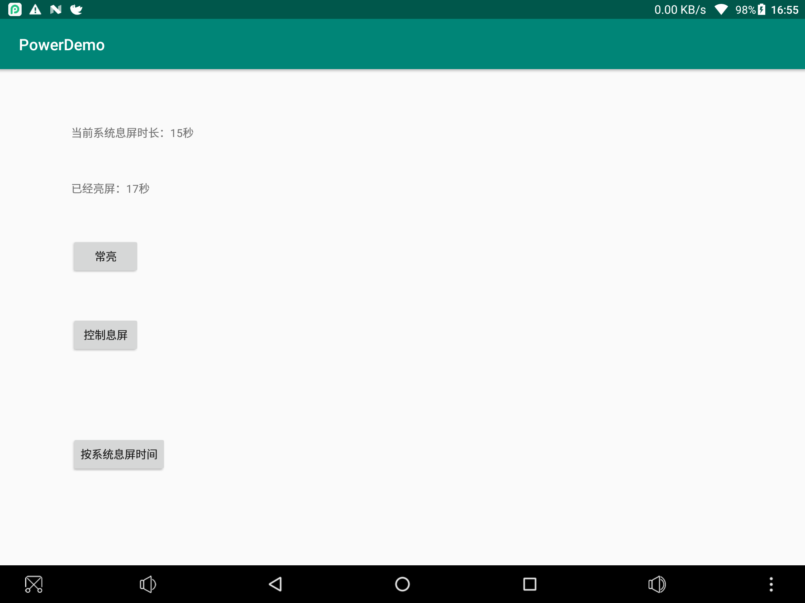

# WakeLock
控制应用打开时息屏时间，可以常亮、自定义时长、随系统时长。

# 参考
### Android 息屏 [我的幕布](https://mubu.com/doc/2TP62AXVWg)
1. 定时熄灭屏幕
    1. wakeLock.acquire() ，应用关闭或者主动 release 之前都不会息屏
    2. wakeLock.acquire(time)，定时息屏，需要在 onPause 调用 release
    3. Settings.System.SCREEN_OFF_TIMEOUT 修改系统休眠时间，需要动态申请 WRITE_SETTINGS 权限
2. 参考：
    1. PowerManager ，需要权限 WAKE_LOCK
        1. https://www.zhangshengrong.com/p/Mr1Wy4PBNG/
            1. goToSleep 无此方法
            2. wakeLock.release() 崩溃，需要先判断 isHeld
            3. 最好 wakeLock?.setReferenceCounted(false)，否则 acquire 需要与 release 一一对应 
            4. PowerManager.SCREEN_DIM_WAKE_LOCK acquire 之内会在原系统息屏的基础上暗屏
        2. Settings 
            1. https://blog.csdn.net/pugongying1988/article/details/9171011
            2. https://blog.csdn.net/shichaosong/article/details/23365243
                1. 可以获得休眠时间、设置休眠时间
                2. 设置系统休眠时间，不只是单个应用的
                
                

